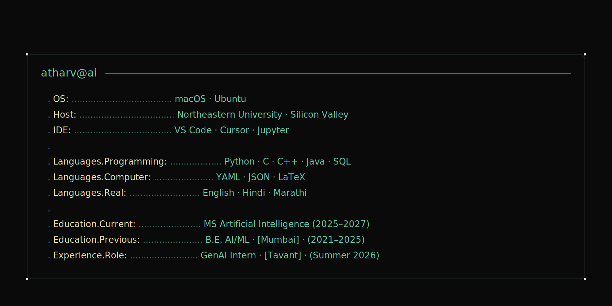

  <!-- Typing Animation -->
  

   
   

<!-- About Banner -->
  
   

  I build machine learning and generative AI systems, with a focus on deep learning, computer vision, and reinforcement learning. Currently pursuing a Master of Science in Artificial Intelligence at Northeastern University, Silicon Valley, after completing a Bachelor of Engineering in Artificial Intelligence and Machine Learning at the University of Mumbai.
   
  My work centres on translating research-grade techniques into reproducible, production-ready systems — from transformer architectures and PPO agents to agentic GenAI applications.

  <!-- Tech Stack Animation -->
  

   

  
  
  
  
  

   

  
  
  
  
  
  

   

  
  
  
  

   

  
  
  
  

   
   

  <!-- Connect Animation -->
  

 

  I am open to Machine Learning Engineer and GenAI Engineer roles, internship opportunities, and conversations about applied AI problems.
   
  Email is the fastest channel.

